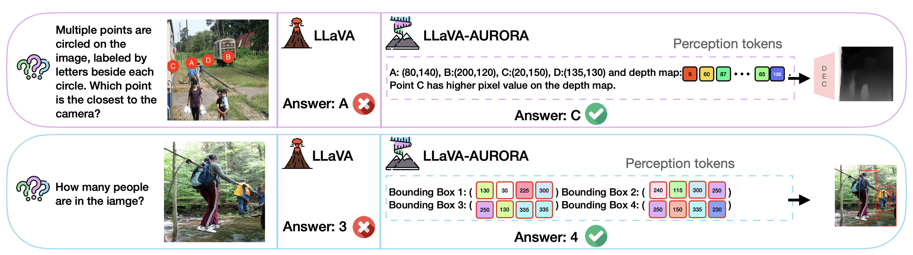

#  Perception Tokens Enhance Visual Reasoning in Multimodal Language Models

 \[[Read our arXiv Paper](https://arxiv.org/pdf/2412.03548v1)\] &nbsp; \[[Project Page](https://aurora-perception.github.io)\] 

[Mahtab Bigverdi](https://mahtabbigverdi.github.io), [Zelun Luo](https://alan.vision), [Cheng-Yu Hsieh](https://chengyuhsieh.github.io), [Ethan Shen](https://ethanlshen.github.io), [Dongping Chen](https://dongping-chen.github.io), [Linda Shapiro](https://homes.cs.washington.edu/~shapiro/), [Ranjay Krishna](http://ranjaykrishna.com/index.html#/)


### Introduction

Multimodal language models (MLMs) struggle with visual reasoning tasks that require intermediate visual representations like depth maps or object bounding boxes, which they cannot naturally produce. To address this, we introduce **Aurora**, a method that augments MLMs with **Perception Tokens**, tokenized image representations that serve as auxiliary reasoning tools—resulting in significant improvements across visual benchmarks and enabling more effective multimodal reasoning.

 

## Installation
Similar to LLaVA follow these steps:
```bash
git clone https://github.com/mahtabbigverdi/Aurora-perception.git
cd Aurora-perception/LLaVA
conda create -n llava python=3.10 -y
conda activate llava
pip install --upgrade pip 
pip install -e .
pip install -e ".[train]"
pip install peft==0.11.1
pip install flash-attn==2.5.9.post1
```


## Dataset

### Depth estimation
To generate depth tokens, follow the installation and usage instructions provided in the [AiT](https://github.com/SwinTransformer/AiT/tree/master) repository.
Follow these steps to prepare the dataset:
1. **Download ADE20k** 

Get the ADE20K dataset from the [official website](https://ade20k.csail.mit.edu).

2. **Generate Pseudo Depth Maps**

Use [DepthAnything](https://github.com/LiheYoung/Depth-Anything) to generate grayscale pseudo depth maps for the ADE images: 

```bash
python run.py --encoder vits --img-path ADE20k --outdir ADE_depth --pred-only --grayscale
```
3. **Train VQVAE**

Use the configuration file provided in this repo to train the VQVAE model from AiT:
```bash
cd AiT/vae
python -m torch.distributed.launch --nproc_per_node=1 train_depth_vqvae_dist.py  configs/depth/ait_depth_vqvae.py
```
4. **Generate Depth Tokens**

After training, use the script below to extract token sequences from depth maps. Update the script with your model path and input directory as needed:
```bash
cd AiT/vae
python get_codes.py
```
This will generate a ``.npy`` dictionary where keys are image filenames and values are depth token sequences in the format:
``<DEPTH_START> <DEPTH_i1> ... <DEPTH_i100> <DEPTH_END>``

5. **Create LLaVA-Style QA Data**

Convert ``ADE_codes.npy`` into a LLaVA-compatible JSON format.
A sample output file is included: ``Data/train_depth_20k.json``

6. **Prepare CoT (Chain-of-Thought) Data with Visual Markers**

Aurora also uses multitask data including CoT-style visual reasoning. For this:

* Use 500 randomly selected ADE images (stored in ``AiT/vae/ADE_500files.npy``)

* Add 2–5 visual markers per image using this notebook:
```bash
AiT/vae/add_marks_ade.ipynb
```
Output: a folder ``ADE_blink/`` with 500 marked images
7. **Merge Depth & CoT Data for Curriculum Learning**

Aurora follows a curriculum learning approach:

* Early epochs focus on depth generation

* Later epochs gradually include more CoT-style reasoning data

To prepare this:

Use ``AiT/vae/create_depth_annealing_data.ipynb``

This creates a single JSON file:
```bash
train_depth_annealing_data.json
```
It contains concatenated training data for all 10 epochs (used with a ``SequentialSampler`` in the DataLoader).

You can download ``train_depth_annealing_data.json`` from [here](https://drive.google.com/file/d/1HvwgZa7x1QTWq8MPwEKBahxxtrK6tIfY/view?usp=sharing).


### Bounding Box Prediction

Just like with depth estimation, follow these steps to prepare the data:
1. Download the LVIS training dataset from the [official webite](https://www.lvisdataset.org/dataset) and install ``pycocotools``.
2. Download ``annotations.json`` from [here](https://drive.google.com/file/d/1M5rZxQVqymk8KFnhjSqPwMUtXnKJGprt/view?usp=sharing) and put it in ``Aurora-perception/Bbox``
3. Open and run the notebook ``Bbox/create_bbox_annealing_data.ipynb`` , following the instructions in each cell.
This will generate the training data for the counting task, you can find the data in ``Data/train_lvis_annealing_data.json``.

## Training
We follow the LoRA fine-tuning instructions from the original LLaVA repository, with a few modifications to ``train.py`` and the fine-tuning scripts to support the introduction of new tokens.

You can find the relevant scripts under  ``LLaVA/scripts/v1_5``.

**depth estimation:**
```bash
cd LLaVA
bash scripts/v1_5/finetune_task_lora_depth_annealing.sh
```
**counting:**
```bash
cd LLaVA
bash scripts/v1_5/finetune_task_lora_lvis_annealing.sh
```

You can download model **checkpoints** from [here](https://drive.google.com/file/d/1r7WYQWYA6VDpzfxPIHP1zEUgBYQmwNIj/view?usp=sharing).

## Evaluations
We use the same evaluation script as the original LLaVA repo, with minor modifications in ``LLaVA/llava/eval/model_vqa.py`` (e.g., changing the temperature parameter).

To generate answers for a ``.jsonl`` question file, use the following command:
```bash
cd LLaVA/llava/eval
python model_vqa.py --model-path /path/to/your/model --question-file /path/to/questions.jsonl --image-folder /path/to/image/folder --answers-file /path/to/output/file 
```
You can then use a separate Python script or a language model to validate the answers against the ground truths.

Evaluation files (images, questions, and answers) for the **HardBLINK** benchmark are available in the`` Data/evals`` directory.

**Note**:
If you want to enable constrained decoding, replace the ``utils.py`` file in the Transformers package (``transformers/generation/utils.py``) with the version provided in ``Aurora-perception/utils.py``.


## Related works
* [Visual Instruction Tuning](https://llava-vl.github.io/)
* [All in Tokens: Unifying Output Space of Visual Tasks via Soft Token](https://github.com/SwinTransformer/AiT)
* [BLINK : Multimodal Large Language Models Can See but Not Perceive](https://zeyofu.github.io/blink/)

## Citation
```bash
@article{bigverdi2024perception,
      title={Perception Tokens Enhance Visual Reasoning in Multimodal Language Models},
      author={Bigverdi, Mahtab and Luo, Zelun and Hsieh, Cheng-Yu and Shen, Ethan and Chen, Dongping and Shapiro, Linda G and Krishna, Ranjay},
      journal={arXiv preprint arXiv:2412.03548},
      year={2024}
    }
```